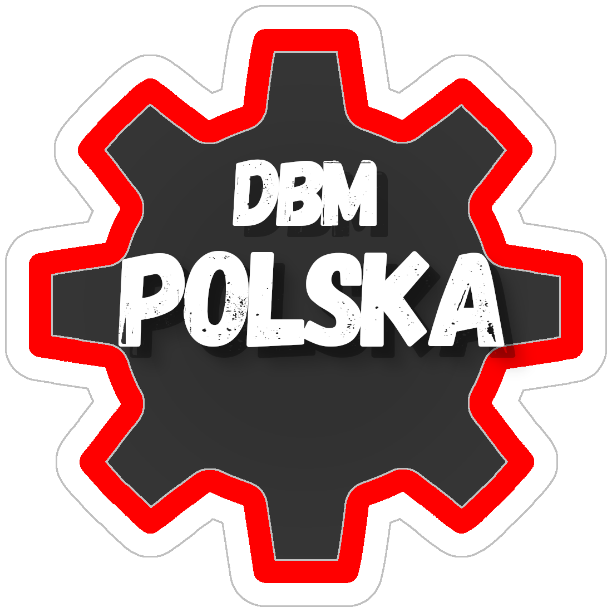

  

    
  

   
  

    <h1><b>
      DiscordJS - 14.25.2
       
      DBM - 4.1.0
       
      
      
      
    </b></h1>
  

**[DBM POLAND](https://dc.dbm-poland.site) is a community-driven open source project whose goal is to modify, extend, and improve [Discord Bot Maker](https://store.steampowered.com/app/682130/Discord_Bot_Maker/).**

---

# Links:

- **Website: https://dbm-poland.site**
- **Discord: https://dc.dbm-poland.site**

# How to Download?

> To download the updated bot and dbm files, go to our website _(link above)_, where you will find the guide and downloads.
